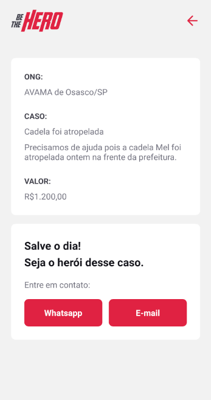

# Be The Hero
[README (en-us)](README-en-us.md)

Application that connects NGOs and volunteers.

Web: NGO Registration and causes.

Mobile: People view all incidents and causes and get in touch with the NGO.





## Requisitos

- [NodeJS 12.*](https://nodejs.org/en/download/)

## Tecnologias/Frameworks

- [React](https://github.com/facebook/react)
- [Express](https://expressjs.com/)
- [React-native](https://reactnative.dev/)
- [Expo](https://expo.io/)
- [Cors](https://github.com/expressjs/cors/)
- [Nodemon](https://nodemon.io/)
- [Knex](http://knexjs.org/)
- [Sqlite](https://www.sqlite.org/index.html)
- [Axios](https://github.com/axios/axios)
<!-- ## Padrões de projeto

- *Clean Architecture* -->

## API Execution

This project uses SQLite, to create the database run the command below at the backend folder.
```
npx knex migrate:run
```
To run the API:

```shell script
npm run start
```
## Run the React Web app

```
npm run start
```
## Mobile App (React-native)
The Expo framework was used to facilitate the development,
therefore, run the command below to open a web page so that you can connect the app with an amulator or your physical device using USB or QR Code.
```
npm run start
```
## Endpoints API

- URL: http://localhost:3333/
- Ongs: http://localhost:3333/ongs
- Sessions: http://localhost:3333/sessions
- Profile: http://localhost:3333/profile
- Incidents: http://localhost:3333/incidents

Obs: It is also available in this repository the json file to import into [Insomnia](https://insomnia.rest/download/)


## Endpoints Web

- URL: http://localhost:3000/
- Register Ong: http://localhost:3000/register
- List Ong's incidents: http://localhost:3000/profile
- Create new incident: http://localhost:3000/indicents/new