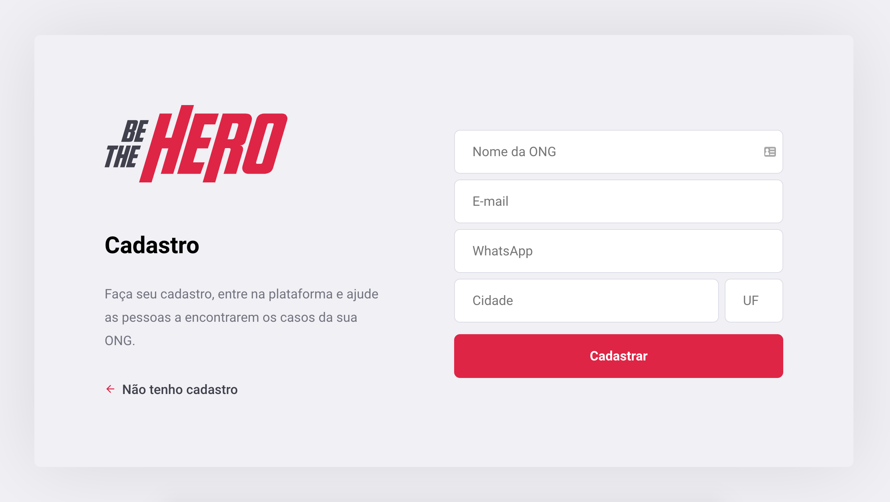
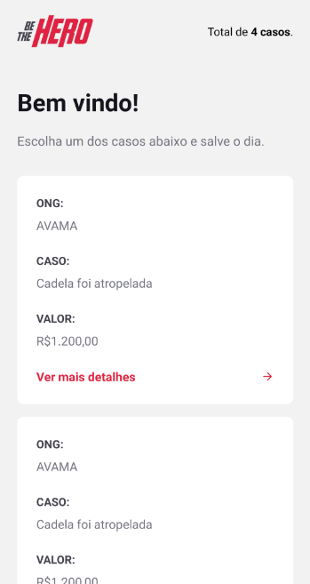
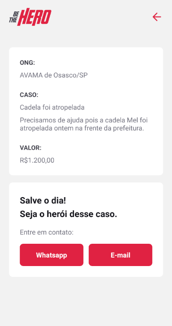

# Be The Hero
[README (en-us)](README-en-us.md)

Aplicação que conecta ONGs e pessoas dispostas a ajudar em causas nobres.

Web: Cadastro de ONGs e de incidentes.

Mobile: Público visualiza todos os incidentes e entra em contato com a ONG.








## Requisitos

- [NodeJS 12.*](https://nodejs.org/en/download/)

## Tecnologias/Frameworks

- [React](https://github.com/facebook/react)
- [Express](https://expressjs.com/)
- [React-native](https://reactnative.dev/)
- [Expo](https://expo.io/)
- [Cors](https://github.com/expressjs/cors/)
- [Nodemon](https://nodemon.io/)
- [Knex](http://knexjs.org/)
- [Sqlite](https://www.sqlite.org/index.html)
- [Axios](https://github.com/axios/axios)
<!-- ## Padrões de projeto

- *Clean Architecture* -->

## Execução API

Esse projeto utiliza SQLite, para criar o banco de dados execute o comando na pasta backend:
```
npx knex migrate:run
```
Para executar a API:

```shell script
npm run start
```
## Execução Web

```
npm run start
```
## Execução App (React-native)
Para o react-native foi utilizado o framework Expo, portanto ao executar o comando abaixo sera aberta uma pagina para executar no emulador, dispositivo fisico via cabo ou lendo o QR Code indicado.
```
npm run start
```
## Endpoints API

- URL: http://localhost:3333/
- Ongs: http://localhost:3333/ongs
- Sessions: http://localhost:3333/sessions
- Profile: http://localhost:3333/profile
- Incidents: http://localhost:3333/incidents

Obs: Está disponível nesse repositório o arquivo json para importação no [Insomnia](https://insomnia.rest/download/).

## Endpoints Web

- URL: http://localhost:3000/
- Register Ong: http://localhost:3000/register
- List Ong's incidents: http://localhost:3000/profile
- Create new incident: http://localhost:3000/indicents/new